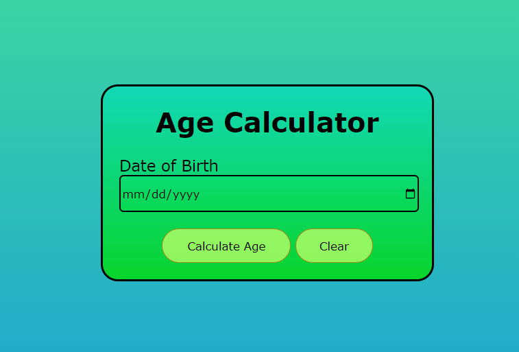
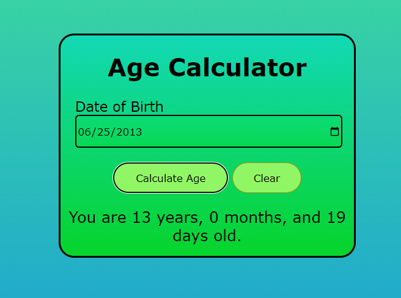

# CodeAlpha_Age_Calculator
A simple and user-friendly web application that calculates a user's exact age based on their date of birth. The application displays the age in years, months, and days while providing a clean, responsive, and intuitive user interface.
________________________________________________________________________________________________________________
## Live Demo

[Age Calculator](https://codealpha-age-calculator-fvmfctbz3-ankush00123s-projects.vercel.app/)
________________________________________________________________________________________________________________

## Screenshots

    

    

________________________________________________________________________________________________________________

# Tools
1. HTML – Structures the webpage and input form.
2. CSS – Styles the application with a clean and responsive layout.
3. JavaScript – Performs age calculation using the Date object, validates user input, and implements the Clear functionality.
________________________________________________________________________________________________________________
# How to use
1. Open the application using the link provided below in a web browser
2. Enter your date of birth in the input field by either typing it manually or selecting it from the interactive calendar provided by html
3. After entering date of birth, Click Calculate Age to display the user's exact age in years, months, and days.
4. The result displays the user's current age based on today's date.
5. Click the clear button to clear both the input field and the displayed result.
________________________________________________________________________________________________________________
# Information
This repository contains my submission for the CodeAlpha Web Development internship task.

Task Requirements
Objective: Create a web-based age calculator using js

Features
1. User inputs date of birth(day, month, year)
2. Output shows calculated age in years, months and days

Key concepts 
1. DOM manipulation
2. Working with js date and time
3. Input validation
________________________________________________________________________________________________________________

